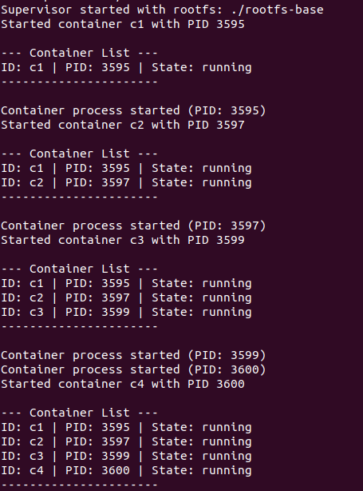
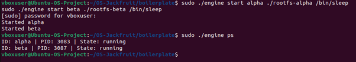
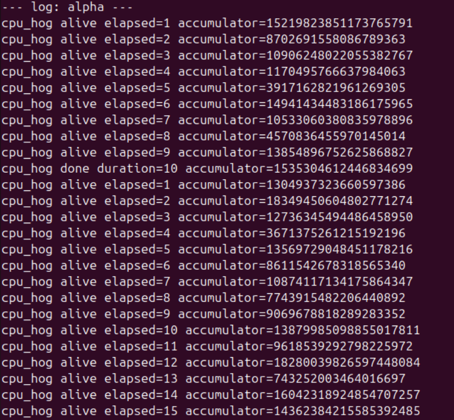
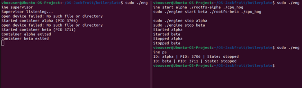
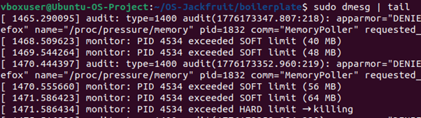
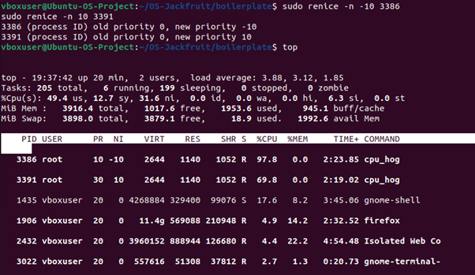
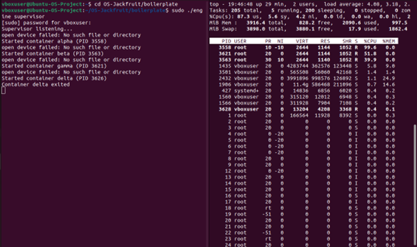
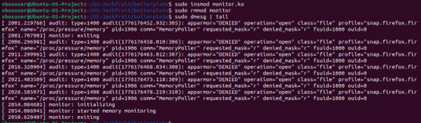
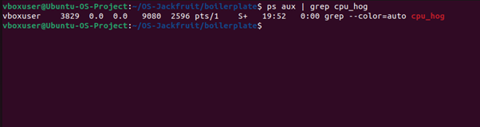
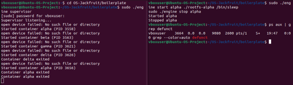

# Multi-Container Runtime — OS Jackfruit

---

## 1. Team Information

| Name            | SRN           |
| --------------- | ------------- |
| Kruthiknandan R | PES1UG24CS239 |
| Samarth Prabhu  | PES1UG24CS905 |

---

## 2. Build, Load, and Run Instructions

### Prerequisites

* Ubuntu 22.04 / 24.04 VM
* Secure Boot disabled
* Install dependencies:

```bash
sudo apt update
sudo apt install -y build-essential linux-headers-$(uname -r)
```

---

### Setup

```bash
cd ~/OS-Jackfruit/boilerplate
```

---

### Prepare Root Filesystem

```bash
mkdir rootfs-base
wget https://dl-cdn.alpinelinux.org/alpine/v3.20/releases/x86_64/alpine-minirootfs-3.20.3-x86_64.tar.gz
tar -xzf alpine-minirootfs-3.20.3-x86_64.tar.gz -C rootfs-base

cp -a rootfs-base rootfs-alpha
cp -a rootfs-base rootfs-beta
```

Copy workloads into containers:

```bash
cp cpu_hog memory_hog io_pulse rootfs-alpha/
cp cpu_hog memory_hog io_pulse rootfs-beta/
```

---

### Build

```bash
make
```

---

### Load Kernel Module

```bash
sudo insmod monitor.ko
ls -l /dev/container_monitor
sudo dmesg | tail
```

---

### Start Supervisor (Terminal 1)

```bash
sudo ./engine supervisor
```

---

### CLI Usage (Terminal 2)

#### Start containers

```bash
sudo ./engine start alpha ./rootfs-alpha ./cpu_hog
sudo ./engine start beta ./rootfs-beta ./cpu_hog
```

---

#### List containers

```bash
sudo ./engine ps
```

---

#### View logs

```bash
cat logs/alpha.log
```

---

#### Stop container

```bash
sudo ./engine stop alpha
```

---

## 3. Memory Limit Test

```bash
cp memory_hog rootfs-alpha/
sudo ./engine start memtest ./rootfs-alpha ./memory_hog
sudo dmesg | tail
```

Expected:

* Soft limit warning
* Hard limit kill

---

## 4. Scheduler Experiments

### Experiment 1 — CPU vs CPU (priority)

```bash
sudo ./engine start alpha ./rootfs-alpha ./cpu_hog
sudo ./engine start beta ./rootfs-beta ./cpu_hog
sudo ./engine ps
```

Apply priorities:

```bash
sudo renice -n -10 <PID_alpha>
sudo renice -n 10 <PID_beta>
top
```

---

### Experiment 2 — CPU vs IO

```bash
sudo ./engine start alpha ./rootfs-alpha ./cpu_hog
sudo ./engine start beta ./rootfs-beta ./io_pulse
top
```

---

## 5. Cleanup

```bash
sudo ./engine stop alpha
sudo ./engine stop beta

ps aux | grep defunct
ps aux | grep cpu_hog

sudo rmmod monitor
sudo dmesg | tail
```

---

## 6. Demo Screenshots

Screenshots are stored in the `screenshots/` directory.

---

### 1. Multi-container supervision


*Multiple containers running under one supervisor*

---

### 2. Metadata tracking


*Output of `engine ps` showing container metadata*

---

### 3. Bounded-buffer logging


*Container output captured in log file*

---

### 4. CLI and IPC


*Command sent from CLI to supervisor via UNIX socket*

---

### 5. Soft-limit warning


*Kernel log showing soft memory limit warning*

---

### 6. Hard-limit enforcement


*Kernel kills container after exceeding hard limit*


---

### 7. Scheduling experiment — Priority container


*Container with lower priority (higher nice value) receiving less CPU time*

---

### 8. Scheduling experiment — CPU vs IO


*CPU-bound process consumes high CPU while I/O-bound process remains responsive*

---

### 9. Clean teardown




*No zombie processes, no leftover processes, and kernel module unloaded successfully*

---

## 7. Engineering Analysis

### Isolation

Uses Linux namespaces:

* PID → process isolation
* UTS → hostname isolation
* Mount → filesystem isolation

---

### Supervisor & Lifecycle

* Supervisor manages all containers
* Uses `clone()` + `exec()`
* Handles `SIGCHLD` → prevents zombies

---

### IPC & Logging

* UNIX socket → CLI communication
* Pipes → logging
* Producer–consumer buffer with mutex + condition variables

---

### Memory Enforcement

* Kernel module tracks RSS
* Soft limit → warning
* Hard limit → kill
* Kernel ensures reliable enforcement

---

### Scheduling

* Lower nice → higher CPU share
* I/O tasks → faster response

---

## 8. Design Decisions & Tradeoffs

| Component   | Choice         | Tradeoff               |
| ----------- | -------------- | ---------------------- |
| Isolation   | chroot         | weaker than pivot_root |
| Supervisor  | single process | less scalable          |
| Logging     | shared buffer  | possible contention    |
| Kernel sync | mutex          | slower than spinlock   |
| Scheduling  | nice values    | not strict guarantees  |

---

## 9. Scheduler Results

### CPU vs CPU

| Container | Priority | Observation |
| --------- | -------- | ----------- |
| alpha     | high     | more CPU    |
| beta      | low      | less CPU    |

---

### CPU vs IO

| Workload | Behavior       |
| -------- | -------------- |
| cpu_hog  | high CPU usage |
| io_pulse | responsive     |

---

## 10. Conclusion

This project implements a complete container runtime integrating:

* User-space container management
* Kernel-space monitoring
* IPC mechanisms
* Scheduling and memory control

It demonstrates core operating system concepts in a practical system.

---
